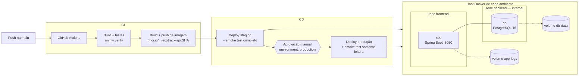
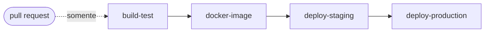

# EcoTrack API — Desafio DevOps (FIAP Fase 6)

API REST em **Java 17 / Spring Boot 3.5** com tema **ESG**: inventário de emissões de gases de efeito estufa
seguindo os escopos do **GHG Protocol** (Escopo 1 — emissões diretas, Escopo 2 — energia comprada,
Escopo 3 — cadeia de valor). A aplicação consolida as emissões por empresa em toneladas de CO₂ equivalente (tCO₂e).

Sobre ela foi construído o ciclo DevOps completo:

| Requisito do desafio | Onde está |
|---|---|
| Pipeline CI/CD com build automático | [`.github/workflows/ci-cd.yml`](.github/workflows/ci-cd.yml) — job `build-test` |
| Testes automatizados | 11 testes (unitários, camada web e integração) + cobertura JaCoCo — [`src/test`](src/test) |
| Deploy automatizado em **staging** e **produção** | jobs `deploy-staging` → `deploy-production`, via [`.github/workflows/deploy.yml`](.github/workflows/deploy.yml) |
| Dockerfile funcional | [`Dockerfile`](Dockerfile) (multi-stage, usuário não-root, healthcheck) |
| Orquestração (app + banco) | [`docker-compose.yml`](docker-compose.yml) — API + PostgreSQL 16 |
| Volumes, variáveis de ambiente e redes | `db-data` / `app-logs`, `deploy/*.env` + secrets, redes `backend` (interna) e `frontend` |
| Documentação técnica e evidências | este README + [`docs/evidencias/`](docs/evidencias) |

---

## 1. Arquitetura



**Camadas da aplicação:** `controller` (REST + validação) → `service` (regras e consolidação em tCO₂e) →
`repository` (Spring Data JPA) → PostgreSQL. O schema é versionado com **Flyway**
([`V1__create_registro_emissao.sql`](src/main/resources/db/migration/V1__create_registro_emissao.sql)) e o Hibernate
apenas valida (`ddl-auto: validate`), como em produção.

### Endpoints

| Método | Rota | Descrição |
|---|---|---|
| `POST` | `/api/emissoes` | Registra uma emissão (retorna `201` + `Location`) |
| `GET` | `/api/emissoes?empresa=&escopo=` | Lista, com filtros opcionais |
| `GET` | `/api/emissoes/{id}` | Busca por id (`404` se não existir) |
| `PUT` | `/api/emissoes/{id}` | Atualiza |
| `DELETE` | `/api/emissoes/{id}` | Remove (`204`) |
| `GET` | `/api/emissoes/resumo?empresa=` | Inventário consolidado: total e por escopo, em tCO₂e |
| `GET` | `/actuator/health`, `/actuator/health/readiness`, `/actuator/info` | Saúde, prontidão e versão/ambiente |
| `GET` | `/swagger-ui.html` | Documentação OpenAPI (desabilitada no perfil `prod`) |

Exemplo:

```bash
curl -X POST http://localhost:8080/api/emissoes -H 'Content-Type: application/json' -d '{
  "empresa": "FIAP", "escopo": "ESCOPO_2", "fonte": "Energia eletrica",
  "quantidadeCo2eKg": 42300, "dataReferencia": "2026-06-30"
}'
curl http://localhost:8080/api/emissoes/resumo?empresa=FIAP
# {"empresa":"FIAP","quantidadeRegistros":1,"totalTCo2e":42.300,"totalPorEscopoTCo2e":{"ESCOPO_1":0.000,"ESCOPO_2":42.300,"ESCOPO_3":0.000}}
```

---

## 2. Executando localmente

Pré-requisitos: Docker (com Compose v2). Para rodar os testes fora do Docker, Java 17 (o Maven vem pelo wrapper `./mvnw`).

```bash
cp .env.example .env            # ajuste POSTGRES_PASSWORD
docker compose up -d --build    # sobe PostgreSQL + API em http://localhost:8080
docker compose ps               # ambos devem ficar "healthy"
docker compose logs -f app
docker compose down             # para tudo (use -v para apagar também os dados)
```

Testes e cobertura:

```bash
./mvnw verify                   # relatório em target/site/jacoco/index.html
```

Simulando o deploy dos dois ambientes na própria máquina (o mesmo script que o pipeline usa):

```bash
docker build -t ecotrack-api:local .
export APP_IMAGE=ecotrack-api:local SKIP_PULL=true

POSTGRES_PASSWORD=senha-stg ./scripts/deploy.sh staging        # http://localhost:8081
EXPECTED_ENV=staging ./scripts/smoke-test.sh http://localhost:8081

POSTGRES_PASSWORD=senha-prd ./scripts/deploy.sh production     # http://localhost:8080
EXPECTED_ENV=production ./scripts/smoke-test.sh http://localhost:8080 --read-only
```

---

## 3. Containerização — `Dockerfile`

| Decisão | Motivo |
|---|---|
| **Multi-stage** (`maven:3.9-eclipse-temurin-17` → `eclipse-temurin:17-jre`) | A imagem final leva só o JRE e a aplicação, sem Maven nem código-fonte |
| `dependency:go-offline` antes do `COPY src` + cache do BuildKit | Mudanças no código não baixam as dependências de novo |
| **Camadas do Spring Boot** (`jarmode=tools extract --layers`) | Dependências ficam em camada própria; um novo deploy só transfere a camada da aplicação |
| Usuário `ecotrack` **não-root** | Reduz o impacto de uma eventual invasão do container |
| `HEALTHCHECK` na readiness probe do Actuator | O Docker/Compose sabe quando a API está pronta de fato, não só quando o processo iniciou |
| `-XX:MaxRAMPercentage=75` | A JVM respeita o limite de memória do container |
| `VOLUME /app/logs` + `APP_VERSION` via `--build-arg` | Logs persistentes; a versão (SHA do commit) aparece em `/actuator/info` |

Imagem multi-arquitetura (roda em amd64 e arm64/Apple Silicon).

## 4. Orquestração — `docker-compose.yml`

Um único arquivo atende **local, staging e produção**. O que muda entre ambientes é o arquivo de variáveis
(`--env-file`) e o **nome do projeto** (`-p`), que dá a cada ambiente containers, redes e volumes próprios:

| | Local | Staging | Produção |
|---|---|---|---|
| Comando | `docker compose up` | `-p ecotrack-staging --env-file deploy/staging.env` | `-p ecotrack-prod --env-file deploy/production.env` |
| Porta | 8080 | 8081 | 8080 |
| Perfil Spring | `default` | `staging` (log DEBUG, SQL visível) | `prod` (log WARN, sem Swagger, health sem detalhes) |
| Banco | `ecotrack` | `ecotrack_staging` | `ecotrack` |

**Serviços**
- `db` — PostgreSQL 16, com healthcheck `pg_isready`.
- `app` — a API; só sobe depois do banco ficar saudável (`depends_on: condition: service_healthy`); `restart: unless-stopped`.

**Volumes**
- `db-data` → `/var/lib/postgresql/data`: os dados sobrevivem a `down`/recriação dos containers (evidência em [`persistencia-volume.txt`](docs/evidencias/persistencia-volume.txt)).
- `app-logs` → `/app/logs`: arquivo de log da aplicação.

**Redes**
- `backend` (**`internal: true`**): liga app e banco; o PostgreSQL não tem porta publicada nem saída para fora.
- `frontend`: rede de borda, onde só a API fica exposta.

**Variáveis de ambiente**
- Não sensíveis: versionadas em [`deploy/staging.env`](deploy/staging.env) e [`deploy/production.env`](deploy/production.env).
- Sensíveis (`POSTGRES_PASSWORD`): nunca ficam no repositório. Localmente vêm do `.env` (ignorado pelo git); no pipeline, dos **secrets de cada GitHub Environment**. O Compose se recusa a subir sem ela (`${POSTGRES_PASSWORD:?...}`).
- `APP_IMAGE`: a imagem exata (tag = SHA do commit) que o pipeline implanta.

---

## 5. Pipeline CI/CD — GitHub Actions



| Job | Quando roda | O que faz |
|---|---|---|
| **build-test** | todo push e PR na `main` | `./mvnw verify`: compila, roda os 11 testes e gera a cobertura JaCoCo. Publica um resumo dos testes na página da execução e salva os relatórios e o `.jar` como artefatos. |
| **docker-image** | push na `main` / manual | Build com Buildx (cache do GitHub Actions) e push para o **GitHub Container Registry**: `ghcr.io/<owner>/ecotrack-api:<sha>` e `:main`. |
| **deploy-staging** | após a imagem | `environment: staging`. Executa `scripts/deploy.sh staging` e o **smoke test completo** (cria, consulta, consolida e apaga um registro). |
| **deploy-production** | após staging passar | `environment: production`, **com aprovação manual** (required reviewers). Faz o deploy **da mesma imagem** validada em staging e roda o smoke test **somente leitura**. |

Garantias do fluxo:
- **Build once, deploy many**: a imagem é construída uma vez e promovida sem alteração de staging para produção.
- Produção só recebe o que passou nos testes **e** no smoke test de staging.
- `scripts/deploy.sh` espera a readiness probe e, se a nova versão não subir, **faz rollback automático** para a imagem anterior (evidência em [`rollback-automatico.txt`](docs/evidencias/rollback-automatico.txt)).
- `concurrency` evita dois pipelines implantando ao mesmo tempo; o Dependabot mantém dependências Maven, actions e imagens base atualizadas.

### Alvo do deploy

O workflow reutilizável [`deploy.yml`](.github/workflows/deploy.yml) funciona de duas formas, conforme os secrets do environment:

1. **Servidor remoto (recomendado para uso real)**: com os secrets `DEPLOY_SSH_HOST`, `DEPLOY_SSH_USER`, `DEPLOY_SSH_KEY` e `POSTGRES_PASSWORD`, o pipeline envia `docker-compose.yml`, `deploy/` e `scripts/` por SSH para qualquer VM com Docker (Azure, AWS EC2, GCP, Oracle Free Tier…), faz login no GHCR, implanta e roda o smoke test.
2. **Runner do GitHub (padrão, sem infraestrutura)**: sem esses secrets, o ambiente é criado no próprio runner com o mesmo Compose e o mesmo script. É efêmero (deixa de existir no fim do job), mas valida de ponta a ponta que a imagem publicada sobe, conecta no banco, aplica as migrations e responde corretamente. O pipeline registra um aviso explicando o modo usado.

### Configuração no GitHub (passo a passo)

1. Crie o repositório e envie o código:
   ```bash
   git init -b main && git add . && git commit -m "EcoTrack API com pipeline CI/CD"
   git remote add origin https://github.com/<usuario>/<repo>.git
   git push -u origin main
   ```
2. **Settings → Environments → New environment**: crie `staging` e `production`.
3. Em `production`, marque **Required reviewers** e adicione você ou o grupo. É o gate de aprovação para produção.
4. *(Opcional, para deploy em servidor real)*: em cada environment, adicione os secrets `POSTGRES_PASSWORD`, `DEPLOY_SSH_HOST`, `DEPLOY_SSH_USER`, `DEPLOY_SSH_KEY` e as variáveis `APP_URL` (link exibido no pipeline) e `DEPLOY_DIR`. O servidor precisa de Docker com Compose v2.
5. Em **Settings → Actions → General → Workflow permissions**, mantenha “Read repository contents and packages permissions” (o workflow pede `packages: write` só onde precisa).

---

## 6. Evidências

Coletadas executando o projeto localmente (Docker Desktop, macOS/arm64) em 19/09/2026:

| Arquivo | Conteúdo |
|---|---|
| [`testes-automatizados.txt`](docs/evidencias/testes-automatizados.txt) | `./mvnw verify`: 11 testes, 0 falhas, cobertura de linhas de 95,7% |
| [`deploy-staging.txt`](docs/evidencias/deploy-staging.txt) / [`deploy-production.txt`](docs/evidencias/deploy-production.txt) | Saída do `deploy.sh` nos dois ambientes |
| [`smoke-test-staging.txt`](docs/evidencias/smoke-test-staging.txt) / [`smoke-test-production.txt`](docs/evidencias/smoke-test-production.txt) | Smoke tests pós-deploy |
| [`containers-volumes-redes.txt`](docs/evidencias/containers-volumes-redes.txt) | Containers healthy, volumes e redes por ambiente, rede interna, variáveis injetadas, usuário não-root |
| [`api-staging.txt`](docs/evidencias/api-staging.txt) | Chamadas reais à API: CRUD, resumo em tCO₂e, validação (400), 404, Actuator, Swagger ligado em staging e desligado em produção |
| [`persistencia-volume.txt`](docs/evidencias/persistencia-volume.txt) | Dados preservados após `docker compose down` + novo deploy |
| [`rollback-automatico.txt`](docs/evidencias/rollback-automatico.txt) | Deploy de versão quebrada revertido automaticamente |

Depois do primeiro push, complemente com prints do GitHub (roteiro em [`docs/evidencias/README.md`](docs/evidencias/README.md)).

---

## 7. Estrutura

```
.
├── .github/
│   ├── workflows/ci-cd.yml      # pipeline: build → testes → imagem → staging → produção
│   ├── workflows/deploy.yml     # workflow reutilizável de deploy (runner ou SSH)
│   └── dependabot.yml
├── deploy/
│   ├── staging.env              # variáveis não sensíveis de staging
│   └── production.env           # variáveis não sensíveis de produção
├── scripts/
│   ├── deploy.sh                # deploy com Compose + espera de readiness + rollback
│   └── smoke-test.sh            # verificações pós-deploy
├── src/main/java/br/com/fiap/ecotrack/
│   ├── controller/  service/  repository/  model/  dto/  exception/
├── src/main/resources/
│   ├── application.yml  application-staging.yml  application-prod.yml
│   └── db/migration/V1__create_registro_emissao.sql
├── src/test/                    # testes unitários, WebMvc e integração (H2 em modo PostgreSQL)
├── docs/evidencias/
├── Dockerfile
├── docker-compose.yml
└── .env.example
```
