# Projeto - Cidades ESGInteligentes

**EcoTrack API**: API REST em **Java 17 / Spring Boot 3.5** para o **inventário de emissões de gases de efeito
estufa** de cidades e organizações, seguindo os escopos do **GHG Protocol**:

| Escopo | O que representa | Exemplo numa cidade |
|---|---|---|
| `ESCOPO_1` | Emissões diretas | Frota de ônibus a diesel |
| `ESCOPO_2` | Energia comprada | Iluminação pública |
| `ESCOPO_3` | Cadeia de valor | Coleta e aterro de resíduos |

A API registra as emissões e consolida o total por organização em toneladas de CO₂ equivalente (tCO₂e). Isso dá à
gestão municipal um indicador ambiental (o "E" do ESG) acompanhável.

Sobre a aplicação foi montado o ciclo DevOps completo: **pipeline CI/CD no GitHub Actions** com build, testes e
deploy automatizado em **staging** e **produção**, aplicação **containerizada** e **orquestrada com Docker Compose**
(API + PostgreSQL, com volumes, variáveis de ambiente e redes).

### Integrantes

| Nome | RM |
|---|---|
| Mateus Bhering Beltrão Santos | RM564760 |
| Ariel Alves Amaral | RM564563 |
| Wesley Santos de França | RM563666 |
| Ronaldo dos Santos Silva | RM561414 |
| Rodrigo Kumamoto Rêgo | RM566049 |

- Repositório: https://github.com/mateusbhering/FIAP_Fase6_Desafio_Devops
- Pipeline: https://github.com/mateusbhering/FIAP_Fase6_Desafio_Devops/actions/workflows/ci-cd.yml
- Documentação técnica (PDF): [`docs/Documentacao-Cidades-ESGInteligentes.pdf`](docs/Documentacao-Cidades-ESGInteligentes.pdf)

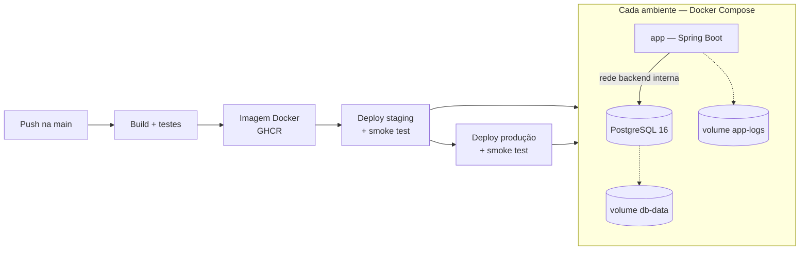

---

## Como executar localmente com Docker

**Pré-requisito:** Docker Desktop (ou Docker Engine) com Compose v2. Não é preciso ter Java nem Maven instalados.

1. Clone o repositório e entre na pasta:
   ```bash
   git clone https://github.com/mateusbhering/FIAP_Fase6_Desafio_Devops.git
   cd FIAP_Fase6_Desafio_Devops
   ```
2. Crie o arquivo de variáveis a partir do exemplo e defina uma senha para o banco:
   ```bash
   cp .env.example .env        # edite POSTGRES_PASSWORD
   ```
3. Suba a aplicação e o banco. A imagem é construída na primeira vez:
   ```bash
   docker compose up -d --build
   ```
4. Confira se os dois containers estão `healthy`:
   ```bash
   docker compose ps
   ```
5. Use a API:
   - Swagger UI: http://localhost:8080/swagger-ui.html
   - Saúde: http://localhost:8080/actuator/health
   ```bash
   curl -X POST http://localhost:8080/api/emissoes -H 'Content-Type: application/json' -d '{
     "empresa": "Prefeitura de Sao Paulo", "escopo": "ESCOPO_2",
     "fonte": "Iluminacao publica", "quantidadeCo2eKg": 98300, "dataReferencia": "2026-06-30"}'

   curl "http://localhost:8080/api/emissoes/resumo?empresa=Prefeitura%20de%20Sao%20Paulo"
   ```
6. Logs e encerramento:
   ```bash
   docker compose logs -f app
   docker compose down        # mantém os dados (volume db-data)
   docker compose down -v     # remove também os dados
   ```

### Subindo staging e produção na própria máquina

É o mesmo script que o pipeline usa. Cada ambiente ganha containers, redes e volumes próprios:

```bash
docker build -t ecotrack-api:local .
export APP_IMAGE=ecotrack-api:local SKIP_PULL=true

POSTGRES_PASSWORD=senha-stg ./scripts/deploy.sh staging       # http://localhost:8081
EXPECTED_ENV=staging ./scripts/smoke-test.sh http://localhost:8081

POSTGRES_PASSWORD=senha-prd ./scripts/deploy.sh production    # http://localhost:8080
EXPECTED_ENV=production ./scripts/smoke-test.sh http://localhost:8080 --read-only
```

### Testes sem Docker (opcional, requer Java 17)

```bash
./mvnw verify        # 11 testes + relatório de cobertura em target/site/jacoco/index.html
```

### Endpoints

| Método | Rota | Descrição |
|---|---|---|
| `POST` | `/api/emissoes` | Registra uma emissão (`201` + cabeçalho `Location`) |
| `GET` | `/api/emissoes?empresa=&escopo=` | Lista, com filtros opcionais |
| `GET` | `/api/emissoes/{id}` | Busca por id (`404` se não existir) |
| `PUT` | `/api/emissoes/{id}` | Atualiza |
| `DELETE` | `/api/emissoes/{id}` | Remove (`204`) |
| `GET` | `/api/emissoes/resumo?empresa=` | Inventário consolidado em tCO₂e: total e por escopo |
| `GET` | `/actuator/health`, `/actuator/health/readiness`, `/actuator/info` | Saúde, prontidão, versão e ambiente |

---

## Pipeline CI/CD

### Ferramentas

| Ferramenta | Uso |
|---|---|
| **GitHub Actions** | Orquestra o pipeline ([`.github/workflows/ci-cd.yml`](.github/workflows/ci-cd.yml) e o workflow reutilizável [`deploy.yml`](.github/workflows/deploy.yml)) |
| **Maven Wrapper + JUnit 5 + Mockito + JaCoCo** | Build, testes automatizados e cobertura |
| **Docker Buildx** | Build da imagem com cache entre execuções |
| **GitHub Container Registry (GHCR)** | Registro da imagem (`ghcr.io/mateusbhering/ecotrack-api`) |
| **GitHub Environments** | Ambientes `staging` e `production`, cada um com seus secrets e regras de aprovação |
| **Docker Compose + scripts Bash** | Deploy ([`scripts/deploy.sh`](scripts/deploy.sh)) e verificação pós-deploy ([`scripts/smoke-test.sh`](scripts/smoke-test.sh)) |
| **Dependabot** | Atualização automática de dependências Maven, actions e imagens base |

### Etapas

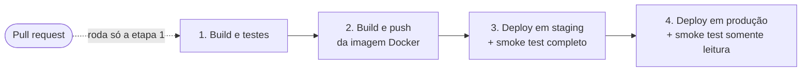

| # | Job | Quando roda | O que faz |
|---|---|---|---|
| 1 | **Build e testes** | Todo push e todo pull request na `main` | Executa `./mvnw verify`: compila, roda os **11 testes** (unitários, camada web e integração com banco) e gera a cobertura JaCoCo. Publica uma tabela com o resultado no resumo da execução e guarda os relatórios e o `.jar` como artefatos. |
| 2 | **Build e push da imagem Docker** | Push na `main` | Constrói a imagem com o [`Dockerfile`](Dockerfile) e publica no GHCR com duas tags: o SHA do commit (versão imutável) e `main`. |
| 3 | **Deploy em staging** | Após a etapa 2 | Implanta a imagem no ambiente `staging` (porta 8081, perfil `staging`) e roda o **smoke test completo**: health, ambiente correto, criação, consulta, consolidação e remoção de um registro. |
| 4 | **Deploy em produção** | Só se staging passar | Implanta **a mesma imagem** no ambiente `production` (porta 8080, perfil `prod`) e roda o smoke test **somente leitura**, para não gravar dados de teste em produção. Pode exigir **aprovação manual** (required reviewers no environment). |

### Funcionamento

- **Build once, deploy many.** A imagem é construída uma única vez e promovida sem alterações de staging para produção. O que foi testado em staging é exatamente o que vai para produção.
- **Gates.** Um teste que falha interrompe o pipeline antes da imagem. Uma falha em staging bloqueia produção.
- **Deploy seguro.** O `deploy.sh` sobe a nova versão com Docker Compose e espera a *readiness probe* do Spring Actuator. Se a aplicação não ficar pronta, ele **faz rollback automático** para a imagem anterior e falha o job.
- **Segredos fora do código.** A senha do banco vem dos *secrets* de cada GitHub Environment e nunca é versionada. O arquivo `deploy/<ambiente>.env` guarda só configurações não sensíveis.
- **Onde o deploy acontece.** O workflow `deploy.yml` suporta dois alvos:
  - **Servidor remoto via SSH.** Com os secrets `DEPLOY_SSH_HOST`, `DEPLOY_SSH_USER`, `DEPLOY_SSH_KEY` e `POSTGRES_PASSWORD` no environment, envia o Compose e os scripts para uma VM com Docker e implanta lá.
  - **Runner do GitHub (configuração atual).** Sem servidor configurado, o ambiente é criado no próprio runner, com o mesmo Compose e os mesmos scripts. Assim o pipeline valida de ponta a ponta que a imagem publicada sobe, conecta no PostgreSQL, aplica as migrations e responde corretamente. O ambiente é efêmero e deixa de existir no fim do job.
- **Concorrência.** `concurrency` impede dois deploys simultâneos. Commits que só alteram documentação (`*.md`, `docs/`) não disparam o pipeline.

Para exigir aprovação manual antes de produção: **Settings → Environments → production → Required reviewers**.

---

## Containerização

### Dockerfile

```dockerfile
# syntax=docker/dockerfile:1

# ---------- Etapa 1: build ----------
FROM maven:3.9-eclipse-temurin-17 AS build
WORKDIR /build

# Baixa dependencias em uma camada separada para aproveitar o cache do Docker
COPY pom.xml .
RUN --mount=type=cache,target=/root/.m2 mvn -B -q dependency:go-offline

COPY src ./src
# Os testes rodam na etapa de CI do pipeline; aqui apenas empacotamos
RUN --mount=type=cache,target=/root/.m2 mvn -B -q package -DskipTests \
 && java -Djarmode=tools -jar target/ecotrack-api.jar extract --layers --launcher --destination target/extracted

# ---------- Etapa 2: runtime ----------
FROM eclipse-temurin:17-jre
LABEL org.opencontainers.image.title="ecotrack-api" \
      org.opencontainers.image.description="API ESG de inventario de emissoes GHG" \
      org.opencontainers.image.licenses="MIT"

RUN groupadd --system ecotrack && useradd --system --gid ecotrack --no-create-home ecotrack \
 && mkdir -p /app/logs && chown -R ecotrack:ecotrack /app
WORKDIR /app

# Camadas do Spring Boot: dependencias mudam pouco, codigo da aplicacao muda sempre
COPY --from=build --chown=ecotrack:ecotrack /build/target/extracted/dependencies/ ./
COPY --from=build --chown=ecotrack:ecotrack /build/target/extracted/spring-boot-loader/ ./
COPY --from=build --chown=ecotrack:ecotrack /build/target/extracted/snapshot-dependencies/ ./
COPY --from=build --chown=ecotrack:ecotrack /build/target/extracted/application/ ./

ARG APP_VERSION=dev
ENV APP_VERSION=${APP_VERSION} \
    LOG_DIR=/app/logs \
    JAVA_TOOL_OPTIONS="-XX:MaxRAMPercentage=75 -XX:+ExitOnOutOfMemoryError"

USER ecotrack
EXPOSE 8080
VOLUME ["/app/logs"]

HEALTHCHECK --interval=15s --timeout=5s --start-period=60s --retries=5 \
  CMD curl -fsS http://localhost:8080/actuator/health/readiness | grep -q '"status":"UP"' || exit 1

ENTRYPOINT ["java", "org.springframework.boot.loader.launch.JarLauncher"]
```

### Estratégias adotadas

| Estratégia | Benefício |
|---|---|
| **Multi-stage build** | A imagem final leva só o JRE e a aplicação, sem Maven, código-fonte nem JDK |
| **Cache de dependências** (`dependency:go-offline` antes do `COPY src` + `--mount=type=cache`) | Alterar o código não baixa as dependências de novo; builds mais rápidos |
| **Camadas do Spring Boot** (`jarmode=tools extract --layers`) | Bibliotecas ficam numa camada separada do código; um novo deploy transfere só alguns KB |
| **Usuário não-root** (`ecotrack`, uid 999) | Reduz o impacto de uma eventual invasão do container |
| **`HEALTHCHECK` na readiness do Actuator** | O Docker e o Compose sabem quando a API está pronta de fato, incluindo a conexão com o banco |
| **`-XX:MaxRAMPercentage=75`** | A JVM respeita o limite de memória do container |
| **Versão injetada** (`--build-arg APP_VERSION`) | O SHA do commit aparece em `/actuator/info`, o que dá rastreabilidade |
| **Imagem multi-arquitetura** (`eclipse-temurin:17-jre`) | Roda em amd64 (runners, servidores) e arm64 (Apple Silicon) |
| **`.dockerignore`** | Contexto de build enxuto, sem `target/`, `.git`, `.env` |

### Imagem criada

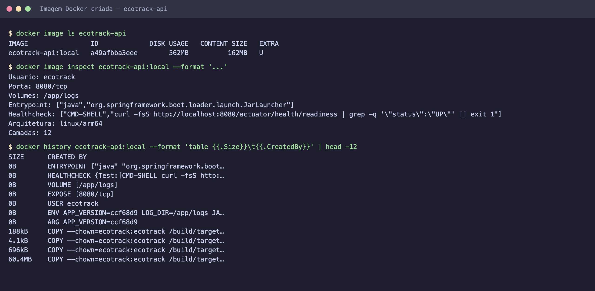

### Orquestração — [`docker-compose.yml`](docker-compose.yml)

| Recurso | Configuração |
|---|---|
| **Serviços** | `db`: PostgreSQL 16 com healthcheck `pg_isready`. `app`: a API, que só sobe depois do banco ficar saudável (`depends_on: condition: service_healthy`) e tem `restart: unless-stopped`. |
| **Volumes** | `db-data`: dados do PostgreSQL, que sobrevivem à recriação dos containers. `app-logs`: arquivo de log da aplicação. |
| **Redes** | `backend` (`internal: true`): liga app e banco; o PostgreSQL não tem porta publicada nem saída para fora. `frontend`: expõe só a API. |
| **Variáveis de ambiente** | `.env` (local, fora do git, modelo em [`.env.example`](.env.example)), [`deploy/staging.env`](deploy/staging.env) e [`deploy/production.env`](deploy/production.env). A senha vem de secret, e o Compose não sobe sem ela (`${POSTGRES_PASSWORD:?...}`). |

Um único arquivo atende os três ambientes. O que muda é o `--env-file` e o nome do projeto (`-p`):

| | Local | Staging | Produção |
|---|---|---|---|
| Projeto Compose | `ecotrack` | `ecotrack-staging` | `ecotrack-prod` |
| Porta | 8080 | 8081 | 8080 |
| Perfil Spring | `default` | `staging` (log DEBUG, SQL visível) | `prod` (log WARN, sem Swagger, health sem detalhes) |
| Banco | `ecotrack` | `ecotrack_staging` | `ecotrack` |

---

## Prints do funcionamento

### Pipeline no GitHub Actions: build, testes, imagem, staging e produção

Execução pública: https://github.com/mateusbhering/FIAP_Fase6_Desafio_Devops/actions/workflows/ci-cd.yml

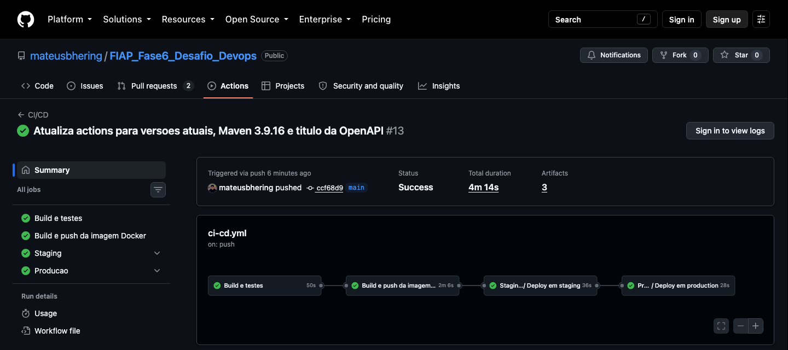

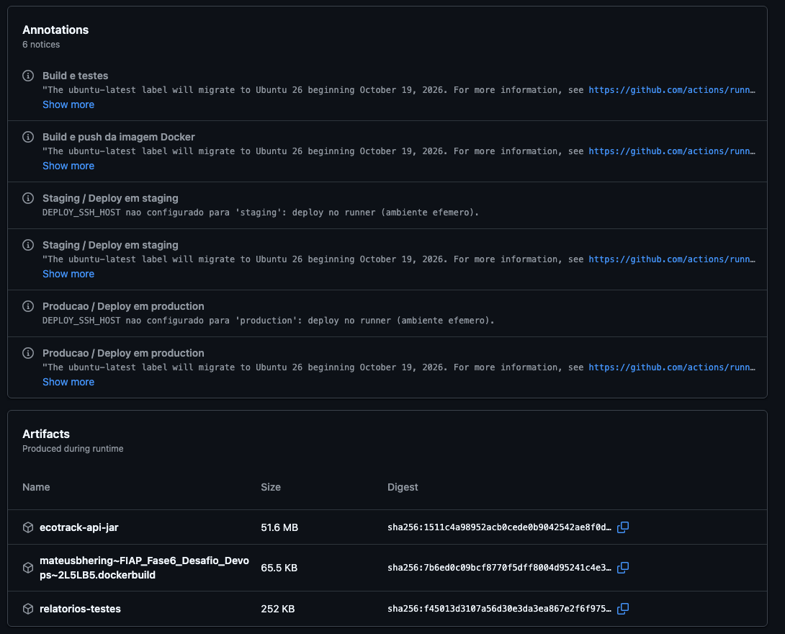

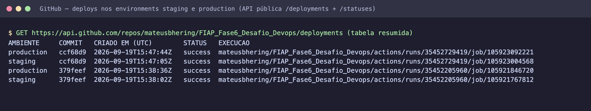

### Testes automatizados

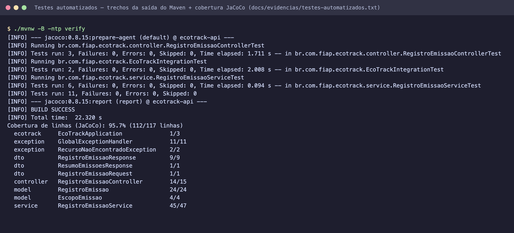

### Staging funcionando (porta 8081)

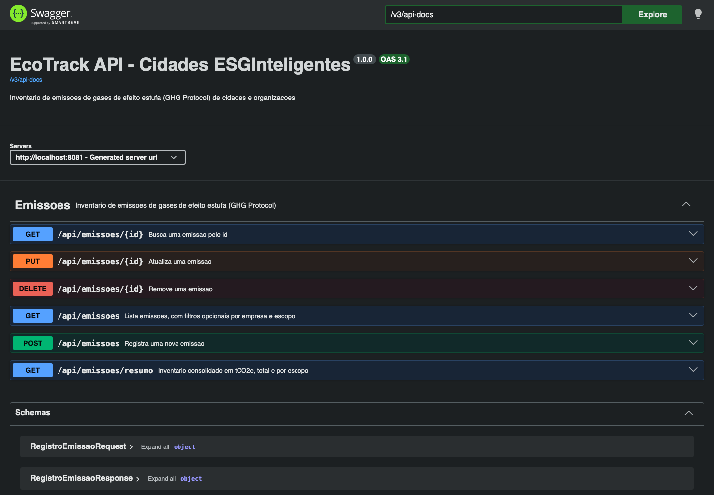

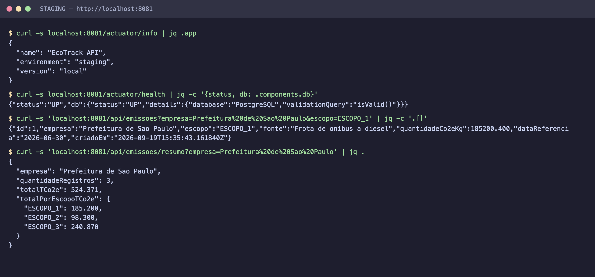

### Produção funcionando (porta 8080)

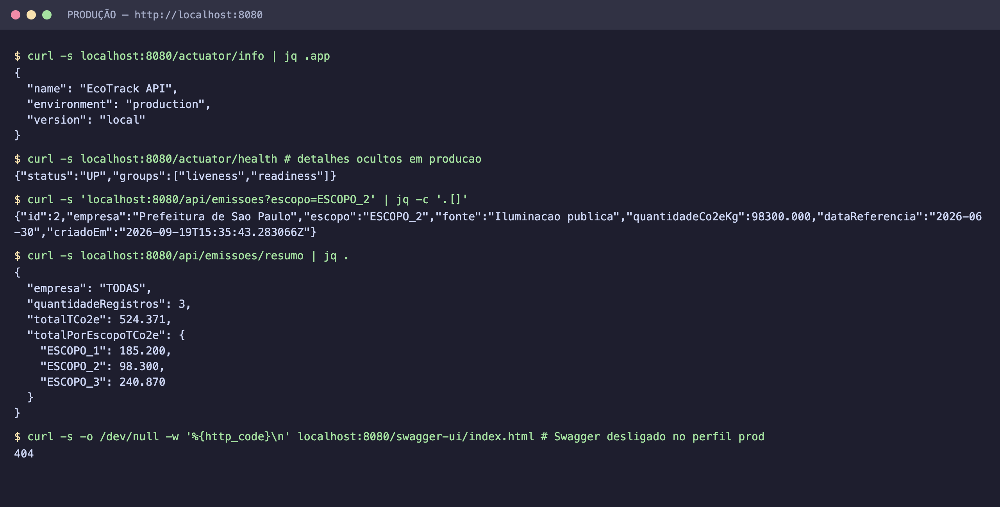

### Containers, volumes, redes e variáveis de ambiente

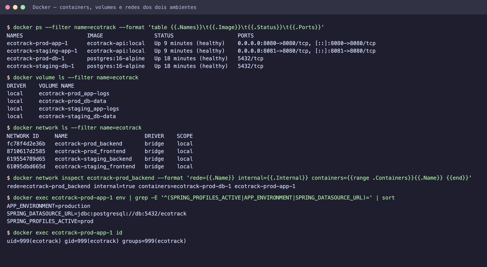

### Smoke tests pós-deploy

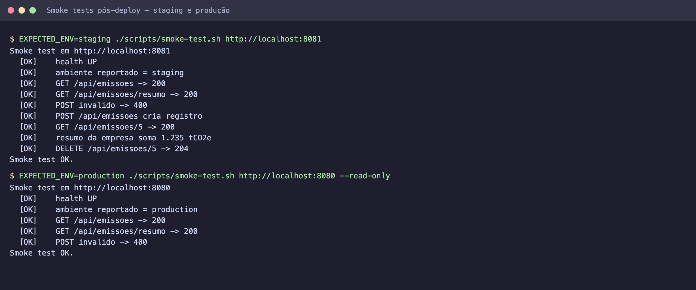

### Robustez: rollback automático e persistência

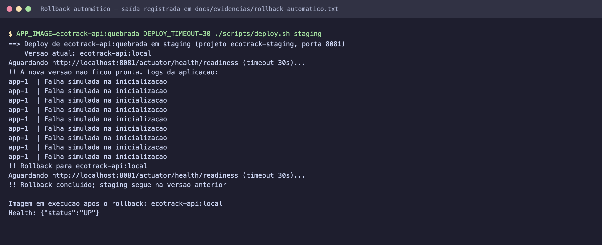

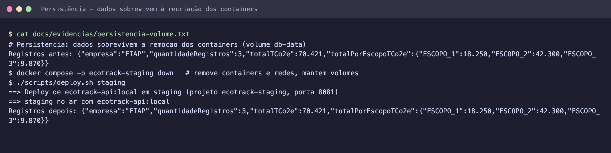

As saídas completas, em texto, estão em [`docs/evidencias/`](docs/evidencias). Os slides com todas as evidências estão em [`docs/Documentacao-Cidades-ESGInteligentes.pdf`](docs/Documentacao-Cidades-ESGInteligentes.pdf).

---

## Tecnologias utilizadas

| Categoria | Tecnologias |
|---|---|
| Linguagem e framework | Java 17, Spring Boot 3.5 (Web, Data JPA, Validation, Actuator) |
| Banco de dados | PostgreSQL 16, Flyway (migrations), H2 em modo PostgreSQL (testes) |
| Documentação da API | springdoc-openapi / Swagger UI |
| Testes e qualidade | JUnit 5, Mockito, AssertJ, Spring MockMvc, JaCoCo |
| Build | Maven 3.9 (Maven Wrapper) |
| Containers | Docker (multi-stage, BuildKit/Buildx), Docker Compose v2 |
| CI/CD | GitHub Actions (workflows reutilizáveis, Environments, Secrets), GitHub Container Registry |
| Automação | Bash (deploy com rollback, smoke tests), Dependabot |
| Imagens base | `maven:3.9-eclipse-temurin-17`, `eclipse-temurin:17-jre`, `postgres:16-alpine` |

---

## Estrutura do projeto

```
.
├── .github/
│   ├── workflows/ci-cd.yml      # pipeline: build → testes → imagem → staging → produção
│   ├── workflows/deploy.yml     # workflow reutilizável de deploy (runner ou servidor via SSH)
│   └── dependabot.yml
├── deploy/                      # variáveis não sensíveis de cada ambiente
│   ├── staging.env
│   └── production.env
├── scripts/
│   ├── deploy.sh                # deploy com Compose, espera de readiness e rollback
│   └── smoke-test.sh            # verificações pós-deploy
├── src/main/java/br/com/fiap/ecotrack/
│   └── controller/ service/ repository/ model/ dto/ exception/
├── src/main/resources/          # application*.yml por perfil + migrations Flyway
├── src/test/                    # testes unitários, web e de integração
├── docs/Documentacao-Cidades-ESGInteligentes.pdf   # documentação técnica (slides)
├── docs/apresentacao/           # fonte HTML do PDF
├── docs/prints/                 # prints do funcionamento
├── docs/evidencias/             # saídas completas em texto
├── Dockerfile
├── docker-compose.yml
├── .env.example
└── pom.xml
```

---

## Checklist de entrega

| Item | OK |
|---|---|
| Projeto compactado em .ZIP com estrutura organizada | ☑ |
| Dockerfile funcional | ☑ |
| docker-compose.yml ou arquivos Kubernetes | ☑ |
| Pipeline com etapas de build, teste e deploy | ☑ |
| README.md com instruções e prints | ☑ |
| Documentação técnica com evidências (PDF ou PPT) | ☑ |
| Deploy realizado nos ambientes staging e produção | ☑ |
